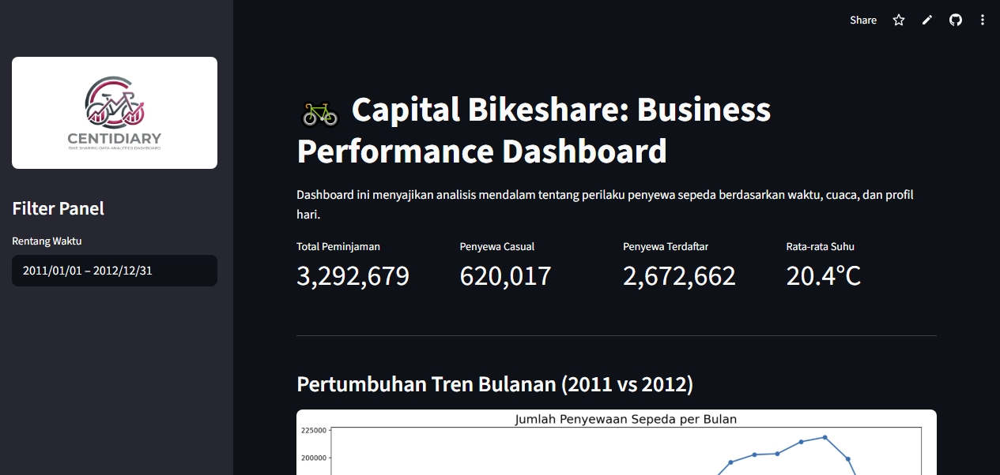

# 🚲 Capital Bikeshare: Business Performance Dashboard


Proyek ini bertujuan untuk melakukan analisis mendalam terhadap dataset bike-sharing guna memahami pola penggunaan sepeda berdasarkan berbagai faktor seperti waktu, kondisi cuaca, dan profil pengguna (kasual vs terdaftar). Hasil analisis ini diharapkan dapat memberikan wawasan strategis untuk optimasi manajemen armada dan strategi pemasaran.
Terdapat dashboard interaktif yang dibuat menggunakan Streamlit untuk menganalisis tren penyewaan sepeda berdasarkan berbagai faktor, seperti cuaca, waktu (jam), dan profil hari (hari kerja vs hari libur).

## 🚀 Fitur Utama
- <b>Exploratory Data Analysis (EDA):</b> Identifikasi tren musiman, harian, dan pengaruh variabel eksternal (suhu, kelembapan) terhadap jumlah penyewaan.
- <b>Data Cleaning & Wrangling:</b> Proses pembersihan data, penanganan nilai hilang, dan penyesuaian tipe data untuk memastikan akurasi analisis.
- <b>Interactive Dashboard:</b> Visualisasi data yang dinamis menggunakan Streamlit untuk mempermudah eksplorasi data secara real-time.

## 📂 Struktur Proyek
- `dashboard/`: Berisi file utama untuk dashboard (`dashboard.py`, `main_data.csv`, dan aset gambar).
- `data/`: Dataset mentah yang digunakan dalam analisis.
- `notebook.ipynb`: Proses analisis data mulai dari Wrangling, Exploratory Data Analysis (EDA), hingga Visualisasi.
- `requirements.txt`: Daftar library Python yang dibutuhkan untuk menjalankan proyek.

## 🛠️ Teknonologi yang Digunakan
- <b>Bahasa Pemrograman:</b> Python
- <b>Library Analisis:</b> Pandas, NumPy
- <b>Visualisasi:</b> Matplotlib, Seaborn
- <b>Deployment Dashboard:</b> Streamlit

## 🛠️ Persiapan Lingkungan (Setup Environment)

### Setup Environment - Anaconda/Conda
```
conda create --name bike-sharing-ds python=3.9
conda activate bike-sharing-ds
pip install -r requirements.txt
```

### Setup Environment - Terminal/Shell
```
cd proyek_analisis_data
python -m venv venv
# Aktivasi venv
# Windows:
venv\Scripts\activate
# Mac/Linux:
source venv/bin/activate
# Install library
pip install -r requirements.txt
```

### Run Stremlit App
streamlit run dashboard/dashboard.py

## Link Dashboard (Streamlit Cloud)
Anda juga dapat mengakses versi live dari dashboard ini melalui tautan berikut:
👉 [Dashboard Bike Share Analysis](https://bike-share-analysis-nabila-najwa-husna.streamlit.app/)

## 📊 Analisis Singkat
- Terdapat peningkatan signifikan jumlah pengguna pada hari kerja di jam berangkat dan pulang kantor.
- Cuaca ekstrem (hujan lebat/salju) menurunkan minat pengguna secara drastis dibandingkan faktor suhu udara.
- Pengguna terdaftar mendominasi total penyewaan pada hari kerja, sementara pengguna kasual meningkat pesat pada akhir pekan.

